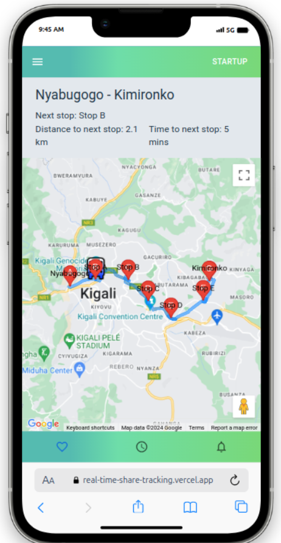

# Real-time Ride-Share Tracking <a name="about-project"></a>

> **Google Maps API Task**: Implement a web application with a map, displaying a route
and real-time progress.


|| Screenshots 📸 ||
|-|----------------------------------|-|
| |  | |


## Links 🔗

- [Demo Link](https://real-time-share-tracking.vercel.app/)
- [Google Map React](https://www.npmjs.com/package/google-map-react#google-map-react----)
- [How to Integrate Google Maps APIs into Your Delivery and Transport App](https://scriptone-solutions.de/en/blogs/how-to-integrate-google-maps-apis-into-your-delivery-and-transport-app.html)

- [Classic Google My Maps Icons](https://www.google.com/maps/d/viewer?mid=1icXjgXJ5da1l2BQjMNgXAI4dlkw&hl=en_US&ll=-0.00700000003837741%2C0.0030000000000196536&z=16)


## 💻 Getting Started <a name="getting-started"></a>

### Context:
- Imagine you're a driver for a transportation agency in Kigali, ready to embark on your
daily route from Nyabugogo to Kimironko. It's your responsibility to pick up passengers at
five stops along the way. To help you and your passengers stay coordinated, you need a
platform that tells you how far you are from the next stop and how long it will take to get
there.

### Objective:
- Develop a web page, as illustrated in the screenshot, that utilizes the Google Maps API
to navigate a route. The page should display the estimated time to reach each upcoming
stop.


### Route Details:
- We’ve provided the geographical coordinates for the starting point, intermediate stops,
and ending point.
 Starting Point: Nyabugogo (-1.939826787816454, 30.0445426438232)
 Intermediate Stops:
 Stop A: (-1.9355377074007851, 30.060163829002217)
 Stop B: (-1.9358808342336546, 30.08024820994666)
 Stop C: (-1.9489196023037583, 30.092607828989397)
 Stop D: (-1.9592132952818164, 30.106684061788073)
 Stop E: (-1.9487480402200394, 30.126596781356923)
 Ending Point: Kimironko (-1.9365670876910166, 30.13020167024439)

###  📖 Task Details:
 Create an interactive map displaying the entire route with marked stops.
 Implement real-time tracking of the driver's current location.
 Calculate and display the ETA for the next stop, assuming constant average speed.

### Install and Run the app 

- After Cloning this repo to your local machine.
- To get it running on your default browser and local host, run:
```
 $ bun install
 $ bun run dev
```
- For this Test I prefer to used  <a href="https://bun.sh/">bun.sh</a> As JavaScript runtime 
- Note: Don't forget to and an .env file with the config map API key


## Contributors

👤 **Ben Mukebo**

- GitHub: [@Ben Mukebo](https://github.com/benmukebo)
- LinkedIn: [@Ben Mukebo](https://www.linkedin.com/in/kasongo-mukebo-ben/)

Contributions, issues, and feature requests are welcome!

## Show your support

Give a ⭐️ if you like this project!


## 🤝 Contributing <a name="contributing"></a>

Contributions, issues, and feature requests are welcome!

Feel free to leave any suggestions at the [Issues page](https://github.com/BenMukebo/hillwood-backend-dashboard/issues)

<p align="right">(<a href="#readme-top">back to top</a>)</p>
